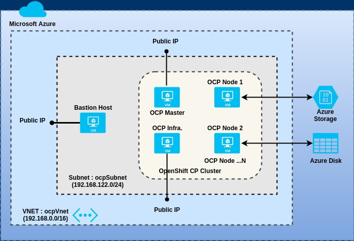

## Automate deployment of Redhat OpenShift on Microsoft Azure.

**Deployment Topology**


**Prerequisites**
- Azure CLI must be installed on your workstation/PC
- You should be logged-in to your Azure account on a terminal window

**A] Deploy a *non-HA* OpenShift Cluster**
1. Open a terminal window on your PC.  Then fork this [GitHub repository](https://github.com/ganrad/ocp-on-azure) to your GitHub account.  Then clone this repository (review Step 3).  Ensure that you are using the GitHub URL of your fork when cloning this repository.  Review and update the following variables in the script `scripts/provision-vms.sh` as necessary.  See below.

VAR NAME | DEFAULT VALUE | DESCRIPTION
-------- | ------------- | -----------
RG_NAME | rh-ocp39-rg | Name of the Azure Resource Group used to deploy the OpenShift Cluster
RG_LOCATION | westus | Region (name) where the IaaS resources should be provisioned eg., eastus, centralus, westus ...
RG_TAGS | CreatedBy=garadha | Tags [name=value] which are to be assigned to the resource group
IMAGE_SIZE_MASTER | Standard_B2ms | Azure VM Image Size for OpenShift master nodes
IMAGE_SIZE_INFRA | Standard_B2ms | Azure VM Image Size for Infrastructure nodes
IMAGE_SIZE_NODE | Standard_B2ms | Azure VM Image Size for Application nodes
VM_IMAGE | RedHat:RHEL:7.4:7.4.2018010506 | Operating system image for all VMs
VNET_CREATE | Yes | Create a separate VNET or use an existing VNET (Values: Yes or No)
VNET_NAME | ocpVnet | Name of the VNET
VNET_ADDR_PREFIX | 192.168.0.0/16 | Network segment for virtual network
SUBNET_NAME | ocpSubnet | Name of the Subnet
SUBNET_ADDR_PREFIX | 192.168.122.0/24 | Network segment for subnet
OCP_DOMAIN_SUFFIX | devcls.com | Domain suffix for hostnames (cluster node hostnames)

After updating `provision-vms.sh`, run the script in a terminal window.  This shell script will provision all the Azure infrastructure resources required to deploy the OpenShift cluster.
```
# Clone this GitHub repository first.  If you are not familiar with GitHub, refer to instructions in Step 4 below.
# Run the script 'scripts/provision-vms.sh'.  Specify, no. of application nodes.
$ ./scripts/provision-vms.sh <no. of nodes>
```
The script should print the following message upon successful creation of all infrastructure resources.
```
All OCP infrastructure resources created OK.
```

2. Login to the Bastion host VM using SSH (Terminal window). Install *Ansible* and *Git*.
```
# Login to Bastion host via SSH.  Substitute the IP Address of the DNS name of the Bastion host.
$ ssh ocpuser@<Public IP Address / DNS name of Bastion Host>
#
# Install ansible
$ sudo yum install ansible
#
# Install git
$ sudo yum install git
#
$ ansible --version
$ git --version
```

3. Fork this [GitHub repository](https://github.com/ganrad/ocp-on-azure) to your GitHub account.  In the terminal window connected to the Bastion host, clone this repository.  Ensure that you are using the URL of your fork when cloning this repository.
```
# Switch to home directory
$ cd
# Clone your GitHub repository.
$ git clone https://github.com/<Your-GitHub-Account>/ocp-on-azure.git
#
$ Switch to the 'ocp-on-azure/ansible-deploy' directory
$ cd ocp-on-azure/ansible-deploy/
```

4. Update `hosts` file with the IP Addresses (or DNS names) of all OpenShift nodes (Master + Infrastructure + Application).

5. Review `group_vars/ocp-servers` file and specify values for **rh_account_name**, **rh_account_pwd** & **pool_id** variables.

6. Check if Ansible is able to connect to all OpenShift nodes.
```
# Ping all OpenShift nodes.  You current directory should be 'ocp-on-azure/ansible-deploy' directory.
$ ansible -i hosts all -m ping
```

7. Run syntax check on ansible playbook.  If there are any errors, fix them before proceeding.
```
# Ensure you are in sub-directory 'ansible-deploy'.  If not, switch to this directory.
$ cd ansible-deploy
#
# Check the syntax of commands in the playbook
$ ansible-playbook -i hosts install.yml --syntax-check
```

8. Run the Ansible playbook `install.yml`.  This command will run for a while (~ 20 mins for 4 nodes).
```
# Run the Ansible playbook
$ ansible-playbook -i hosts -v install.yml
```
For each OpenShift node (VM), the `ansible-playbook` command should print a count of all tasks successfully executed (ok), changed and failed. If there are any **failed** tasks, re-run the playbook until all tasks are successfully executed on all nodes. Upon successful execution of all playbook tasks on all nodes, the following message will be printed in the output.
```
PLAY RECAP *********************************************************************************************************************************
ocp-infra.devcls.com       : ok=14   changed=12   unreachable=0    failed=0   
ocp-master.devcls.com      : ok=14   changed=12   unreachable=0    failed=0   
ocp-node1.devcls.com       : ok=14   changed=12   unreachable=0    failed=0   
ocp-node2.devcls.com       : ok=14   changed=12   unreachable=0    failed=0
```

9. Login via SSH to the OpenShift **Master** node (VM).  The OpenShift installer (Ansible playbook) should be run on this VM/Node.  Before proceeding with OpenShift installation, check the following -
- Make sure you are able to login to all nodes/VMs (Master + Infrastructure + Application) using SSH
- All nodes should be resolvable thru their DNS aliases within the VNET (ocpVnet)
- Passwordless **sudo** access should be configured on all nodes (VMs)

Download the Ansible hosts file (`scripts/ocp-hosts`) from the `ocp-on-azure` GitHub repository which you forked in a previous step.  You can use **wget** or **curl** to download this file.  See below.
```
# Download the ansible hosts file 'scripts/ocp-hosts'. Substitute your GitHub account name in the command below.
$ wget https://raw.githubusercontent.com/<YOUR_GITHUB_ACCOUNT>/ocp-on-azure/master/scripts/ocp-hosts
```
Review the **ocp-hosts** file and update the hostnames for the OpenShift Master, Infrastructure and Application nodes/VMs.  Make other configuration changes as necessary.

10. Obtain the subscription ID for your Azure account.
```
# Retrieve subscription info. for your Azure account
$ az account show
```
Note down the values for **id** (Subscription ID) and **tenantId** (AD Tenant ID) from the output of the above command.

11. Create an Azure Service Principal (SP).  This SP will be used by the *Azure Cloud Provider* OpenShift plug-in to create persistent volumes dynamically.  In a later step, we will define a Kubernetes *Storage Class* object for Azure disk storage and configure it as the default storage provider for persistent volumes for the OpenShift cluster.
```
# Create an Azure Service Principal
$ az ad sp create-for-rbac --name ocpcloudprovider --password Cl0udpr0viders3cr3t --role contributor --scopes /subscription/<Subscription ID>/resourceGroups/rh-ocp39-rg
```
Record the output of the above command by saving it in a file.

12. 

10. Run the OpenShift Ansible Playbooks as below.
- Run the `prerequisites.yml` playbook to run pre-requisite checks
```
# Run the 'prerequisites.yml' playbook to run pre-requisite checks
$ ansible-playbook -i ./ocp-hosts /usr/share/ansible/openshift-ansible/playbooks/prerequisites.yml
```
If all the checks pass, you should see the output as below.
```
PLAY RECAP *********************************************************************************************************************************
localhost                  : ok=11   changed=0    unreachable=0    failed=0   
ocp-infra.devcls.com       : ok=60   changed=14   unreachable=0    failed=0   
ocp-master.devcls.com      : ok=74   changed=15   unreachable=0    failed=0   
ocp-node1.devcls.com       : ok=60   changed=14   unreachable=0    failed=0   
ocp-node2.devcls.com       : ok=60   changed=14   unreachable=0    failed=0
```
- Next, run the `deploy_cluster.yml` playbook to deploy the OpenShift cluster.  This cluster deployment script should run for approximately 30-40 minutes (~ 4 nodes).
```
# Run the 'deploy_cluster.yml' playbook to deploy the OpenShift cluster
$ ansible-playbook -i ./ocp-hosts /usr/share/ansible/openshift-ansible/playbooks/deploy_cluster.yml
```
When the Ansible playbook run finishes, the output should list the status of all executed tasks.  If there are any tasks in failed state, review the exception messages, update the playbook (`install.yml`) and re-run the playbook.

11.  OpenShift Web Console can be accessed @ - `https://<OpenShift Master Public Hostname>/`

Substitute the DNS name of the OpenShift cluster **Master Node** in the URL above.
